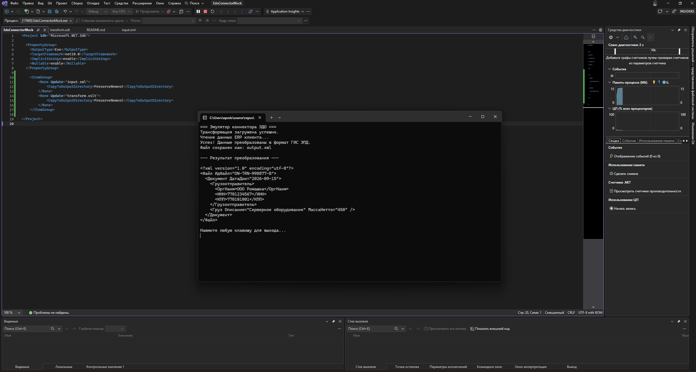

# EdoConnectorMock: Коннектор для интеграции ЭТрН (XSLT)

Консольное приложение на **C#**, демонстрирующее работу middleware-коннектора для обмена электронными транспортными накладными (ЭТрН). Проект имитирует реальный кейс интеграции нестандартной учетной системы клиента (ERP) с платформой оператора ЭДО (на примере требований Контур.Логистики).

## 📸 Демонстрация работы

## 📌 Суть решаемой задачи
Учетная система клиента генерирует данные о грузоперевозках в собственном кастомном XML-формате. 
**Цель:** С помощью `XSLT` и `XPath` распарсить входящий файл, извлечь необходимые узлы, отформатировать типы данных и пересобрать XML в строгий формат, соответствующий требованиям ФНС и ГИС ЭПД.

## 🛠 Стек технологий
*   **C# / .NET** — использование класса `XslCompiledTransform` для загрузки и применения трансформаций.
*   **XML / XSLT 1.0** — декларативное описание правил преобразования документа.
*   **XPath** — навигация по DOM-дереву и извлечение данных.
*   **Regex (System.Text.RegularExpressions)** — предварительная валидация данных (проверка формата ИНН) перед обработкой.

## ⚙️ Технические особенности XSLT-скрипта
В рамках файла `transform.xslt` реализованы следующие операции:
1.  **Конкатенация строк (`concat`):** Динамическое формирование уникального атрибута `ИдФайл` на основе номера заказа.
2.  **Работа с подстроками (`substring`):** Парсинг и конвертация сырой даты из клиентского формата `ДД.ММ.ГГГГ` в требуемый стандарт `ГГГГ-ММ-ДД`.
3.  **Реструктуризация DOM-дерева:** Перенос текстовых значений из дочерних XML-элементов (например, `Cargo/Description`) в XML-атрибуты финального документа (`<Груз Описание="...">`).
4.  **Использование локальных переменных (`xsl:variable`):** Оптимизация промежуточных вычислений внутри шаблона.

## 🚀 Запуск проекта
1. Склонируйте репозиторий.
2. Откройте решение `EdoConnectorMock.sln` в Visual Studio.
3. Убедитесь, что файлы `input.xml` и `transform.xslt` копируются в выходной каталог при сборке (настроено в `.csproj` через `<CopyToOutputDirectory>PreserveNewest</CopyToOutputDirectory>`).
4. Запустите проект (F5). Программа прочитает исходный файл, применит трансформацию и сохранит готовый результат в `output.xml`.
